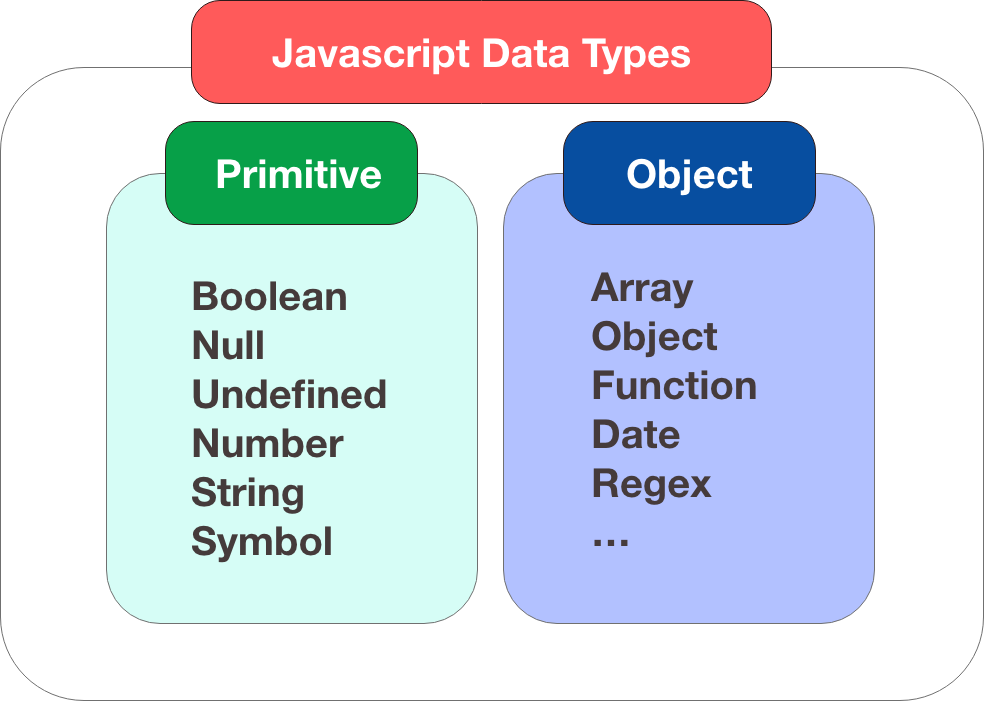

变量
===
变量是数据的“命名存储”。在 JavaScript 中创建变量，需使用 `let` 关键字。
```js
let message; // 创建一个名为 message 的变量
message = 'Hello'; // 将字符串 "hello" 赋值给变量 message

alert(message); // 显示变量内容
```
>旧的脚本可能会使用 `var` 关键字，但这种方式较为老旧。
> 此外，`var` 与 `let` 存在以下区别：
> - 作用域：`var` 是函数作用域，在函数里使用 `var` 声明变量将在整个函数内部有效，在函数外声明，则是全局变量。`let` 块级作用域，`let` 声明的变量只在所在的块 `{}` 内有效。
> - 变量提升（Hoisting）不同：`var` 声明会提升到作用域顶部，但值不会提升。`let`虽然也会提升，但会进入**暂时性死区**（TDZ, Temporal Dead Zone）
> ```js
  console.log(a);   // undefined （因为 var 提升，但值未提升）
>var a = 10;
>console.log(b);    // ❌ ReferenceError（因为 TDZ）
>let b = 20;
> ```
> - 是否允许重复声明：`var` 允许同一作用域下可以重复声明；`let` 则不可
> - 是否绑定到全局对象：`var` 声明的全局变量会绑定到 `window` 对象，`let` 声明的全局变量不会绑定到 `window`

变量命名限制：
1. 名称只能包含字母、数字或 `$` 和 `_` 。
2. 第一个字符不得是数字。
当名称包含多个单词时，通常使用 `camelCase` （驼峰命名法：除第一个单词外，所有单词以大写字母开头）

常量
===
使用 `const` 来声明常量，常量不允许重新赋值。
```js
const myBirthday = '18.04.1982';

myBirthday = '01.01.2001'; // ❌ Error, can't reassign the constant!
```
更通常的做法是使用大写字母和下划线命名常量。如 `const COLOR_RED = "#F00";`
注意：常量只是意味着变量的值永远不会改变，但有些常量可以在运行时计算（不过在初始分配后不会更改）
```js
const pageLoadTime = /* time taken by a webpage to load */;
```
这里 `pageLoadTime` 的值在页面加载之前是未知的，因此正常命名。

数据类型
===


JavaScript 是动态类型语言，变量不会和数据类型绑定。
- `number` ：表示整数和浮点数. 支持 `+, -, *, /` 运算，除了常规数字外，还包括 `Infinity, -Infinity, NaN` 特殊数值。
```js
let n = 123;
n = 12.34;

alert( 1 / 0 ); // Infinity
alert( "not a number" / 2 ); // NaN, such division is erroneous
alert( NaN + 1 ); // NaN
alert( 3 * NaN ); // NaN，如果数学表达式某个地方为 NaN ，将传播到整个结果，只有一个例外：NaN ** 0 是 1 
```

- `BigInt`：在 JS 中，`number` 类型不能安全地表示大于 $2^{53}-1$ 的值或小于 $-(2^{53}-1)$ 的整数值，`BigInt` 用以表示任意长度的整数。`BigInt` 值是通过将 `n` 附加到整数的末尾来创建的：
```js
// the "n" at the end means it's a BigInt
const bigInt = 12345678901234567890123456789n;
```

- `String`：JS 中字符串必须用引号（双引号、单引号）括起来。
> 反引号 (\`\`)  是扩展功能引号，允许通过将变量和表达式包装在 `${...}` 中来将它们嵌入到字符串中。
```js
let name = "John";
// embed a variable
alert( `Hello, ${name}!` ); // Hello, John!

// embed an expression
alert( `the result is ${1 + 2}` ); // the result is 3
```
注意：在 JS 中，并没有 `char` 字符类型。

- `Boolean`：`true` 和 `false`
```js
let isGreater = 4 > 1;
alert( isGreater ); // true (the comparison result is "yes")
```

- `null`：空值，不属于以上任何类型。JS 中的 `null` 不想其他语言那样是“对不存在对象的引用”或“null指针”。只是一个表示“nothing”，“empty”或“value unknown”的特殊值。

- `undefined`：未分配值。如果变量被声明但未赋值，则其值是 `undefined`。

- `symbol`：独一无二的标识符
```js
const s1 = Symbol();
const s2 = Symbol();

console.log(s1 == s2); // false

// 带描述创建 Symbol
const s = Symbol("id");
console.log(s.toString()); // Symbol(id)
```

- `object`：以上类型为基类型（primitive type），其值只能包含单个内容. `object` 用于存储数据集合和更复杂的实体。`symbol` 类型可为对象创建唯一标识符。

`typeof` 运算符：返回操作数的类型。等价于 `typeof(x)`
```js
typeof undefined // "undefined"
typeof 0 // "number"
typeof 10n // "bigint"
typeof true // "boolean"
typeof "foo" // "string"
typeof Symbol("id") // "symbol"
typeof Math // "object"  (1)
typeof null // "object"  (2)，语言本身错误
typeof alert // "function"  (3)
```
注意：`typeof` 并非函数，而是运算符。

与访问者交互函数
===
- `alert`：显示一条消息，并等待用户按 OK .
```js
alert(message)
```
- `prompt`：显示一条消息，要求用户输入文本。将返回文本或者在用户点击 Cancel 按钮或 `Esc` 后返回 `null`。
```js
prompt(title, [default]);
// title: 要想访问者显示的文本
// default：可选的默认值
```
- `confirm`：`confirm` 函数显示一个 modal window（模式窗口），其中包含一个问题和两个按钮：OK 和 Cancel. 根据选择返回 `true` 或 `false`.
```js
let isBoss = confirm("Are you the boss?");
alert( isBoss ); // true if OK is pressed
```
> [!NOTE]
> modal window（模态窗口）：一种覆盖在页面内容之上的对话框。通常会锁定页面的交互（用户必须先关闭它，才能回到主页面）。上述三个函数均触发 JS 的模态窗口。不足之处是无法定制其样式。

类型转换
===
1. 字符串转换：`String(value)` 将值转换为字符串
```js
let value = true;
value = String(value); // now value is a string "true"
alert(typeof value); // string
```

2. 数字转换：数学函数和表达式中的数字转换自动发生。也可以使用 `Number(value)` 函数显式地将 `value` 转换为数字。
```js
alert( "6" / "2" ); // 3, strings are converted to numbers

let str = "123";
alert(typeof str); // string

let num = Number(str); // becomes a number 123
alert(typeof num); // number
```

| **Value**          | Becomes...                                              |
| ------------------ | ------------------------------------------------------- |
| `undefined`        | `NaN`                                                   |
| `null`             | 0                                                       |
| `true` and `false` | 1 和 0                                                   |
| `string`           | 如果除去开头和结尾的空格符，剩余字符串为空，则结果为 0 。否则，将从字符串中数字，非数字则返回 `NaN`. |
注意：如果字符串不是有效数字，则此类转换的结果为 `NaN`.
```js
alert( Number("  123  ") ); // 123
alert( Number("123z") ); // NaN(error reading a number at "z")
```
3. 布尔转换：发生在逻辑操作中，也可以通过调用 `Boolean(value)` 来显式执行。
转换规则：
- 直观上“空”的值（如 0，空字符串，`null`，`undefined` 和 `NaN`）为 `false`
- 其他值为 `true`
```js
alert( Boolean(1) ); // true
alert( Boolean(0) ); // false
alert( Boolean("hello") ); // true
alert( Boolean("") ); // false
alert( Boolean("0") ); // true; 这里需注意
alert( Boolean(" ") ); // true; 任何非空字符串均为 true
```

示例：
```js
"" + 1 + 0 = "10"
"" - 1 + 0 = -1
true + false = 1
6 / "3" = 2
"2" * "3" = 6
4 + 5 + "px" = "9px"
"$" + 4 + 5 = "$45"
"4" - 2 = 2
"4px" - 2 = NaN
"  -9  " + 5 = "  -9  5"
"  -9  " - 5 = -14
null + 1 = 1
undefined + 1 = NaN
" \t \n" - 2 = -2
```

严格相等运算符
===
常规相等检查 `==` 无法区分 `0` 和 `false`。
```js
alert( 0 == false ); // true
alert( '' == false ); // true
alert( null == undefined ); // true
```
严格相等运算符 `===` 使得在不进行类型转换的情况下检查相等性。即，如果 `a` 和 `b` 属于不同的类型，则 `a === b` 会立即返回 `false`，而无需尝试转换它们。
```js
alert( 0 === false ); // false, 由于类型不同
alert( null === undefined ); // true
```
同样，还存在严格不相等运算符 `!==` 
> [!NOTE]
> 不同运算符遵循的类型转换规则不同。
> 在 `==`（相等检查） 下，`null` 只等于 `undefined`，所以 `null == 0` 为 `false`
> 在 `>=`（或其他比较运算符）下，`null` 会被强制转换为数字 `0` ，所以 `null >= 0` 为 `true`

```js
alert( undefined > 0 ); // false (1)
alert( undefined < 0 ); // false (2)
alert( undefined == 0 ); // false (3)
```
Comparisons：`(1)` 和 `(2)` 返回 `false`，因为 `undefined` 被转换为 `NaN` ，而 `NaN` 是一个特殊的数值，对所有比较都返回 `false`.
Equality check：`(3)` 返回 `false`，因为 `undefined` 只等于 `null`，`undefined`

---
`&&` （逻辑与运算符）：如果左边是假值（falsy），返回左边；否则返回右边
`||`（逻辑或运算符）：如果左边是真值（truthy），返回左边；否则返回右边。
`falsy`：`false`, 0, -0, `0n`（BigInt 零）, `""`, `null`, `undefined`, `NaN`
其他都是 `truthy`
此外：`&&` 优先级高于 `||`
示例：
```js
console.log(1 || 0);          // 1  (第一个是真值，直接返回)
console.log(null || "hello"); // "hello" (null 是 falsy，返回右边)
console.log(undefined || 0);  // 0  (两边都是 falsy，返回最后一个)
console.log("" || []);        // [] (空数组是 truthy)
// 常用于默认值设置
let username = input || "Guest";

console.log(1 && 0);         // 0  (遇到 falsy，返回它)
console.log(1 && "hello");   // "hello" (都是真值，返回最后一个)
console.log(null && "hi");   // null (第一个 falsy，直接返回)
console.log("a" && "b" && "c"); // "c" (全是 truthy，返回最后一个)
```

---
`??`：空值合并运算符（Nullish Coalescing Operator）
语法：（如果 `a` 是 `null` 或 `undefined`，返回 `b`；否则返回 `a`）
```js
a ?? b
```
示例：
```js
console.log(null ?? "default"); // "default"
console.log(0 ?? "default"); // 0 (0 不是 null/undefined)
console.log(false ?? "default"); // false
```
常见用途：
- 给参数设置默认值
```js
function greet(name) {
	let user = name ? "Guest";
	console.log("Hello " + user);
}
greet("Alice"); // Hello Alice
greet(null);    // Hello Guest
greet();        // Hello Guest
```
出于安全原因，JavaScript 禁止将 `??` 与 `&&` 和 `||` 一起使用，除非使用括号明确指定优先级。
```js
let x = 1 && 2 ?? 3; // Syntax error
```

---
函数
===
函数是程序的主要“构建块”，允许多次调用而不会重复。

函数声明：（可以使用 `para = defaultValue` 来指定默认值）
```js
function funcName(parameter1, parameter2, ... parameterN) {
	// body
}
```
局部变量：在函数中声明的变量，作用域仅在函数中可见。
外部变量：函数外声明的变量。
如果在函数内部声明了一个同名的变量，将会隐藏外部变量。

函数返回值为空或没有返回值的函数返回 `undefined` 。
```js
function doNothing() {
	/* empty */
}
alert( doNothing() === undefined ); // true

function doNothing() {
	return;
}
alert( doNothing() === undefined ); // true
```

函数表达式：在任何表达式的中间创建一个新函数。
```js
let sayHi = function() {
	alert( "Hello" );
};
```
这里变量 `sayHi` 得到一个值，即新函数。
不管是函数声明，还是函数表达式，结果都是——一个函数被存放在变量 `sayHi` 里。即：函数本质上也是值。

回调函数：作为参数传递给函数的函数，期望它在以后必要的时候被调用。
```js
function ask(question, yes, no) {
	if (confirm(question)) yes();
	else no();
}

function showOk() {
	alert( "You agreed." );
}
function showCancel() {
	alert( "You canceled the execution." );
}

// usage: functions showOk, showCancel are passed as arguments to ask
```

箭头函数：
```js
let func = (arg1, arg2, ..., argN) => expression;
//等价于
let func = function(arg1, arg2, ..., argN) {
	return expression;
};

let sayHi = () => alert("Hello!");

// 多行箭头函数
let sum = (a, b) => { // the curly brace opens a multiline function
    let result = a + b;
	return result; // 使用花括号，需显式 return
}
```

